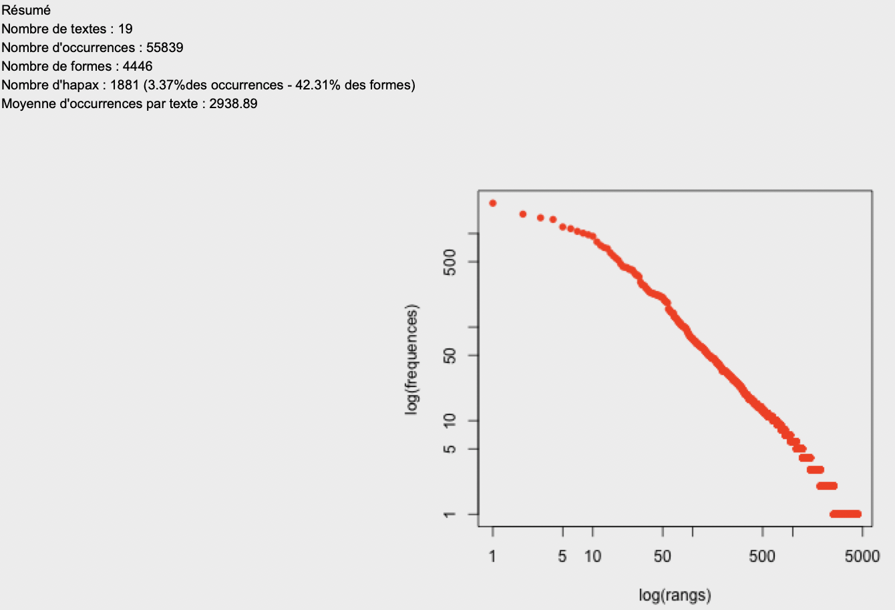
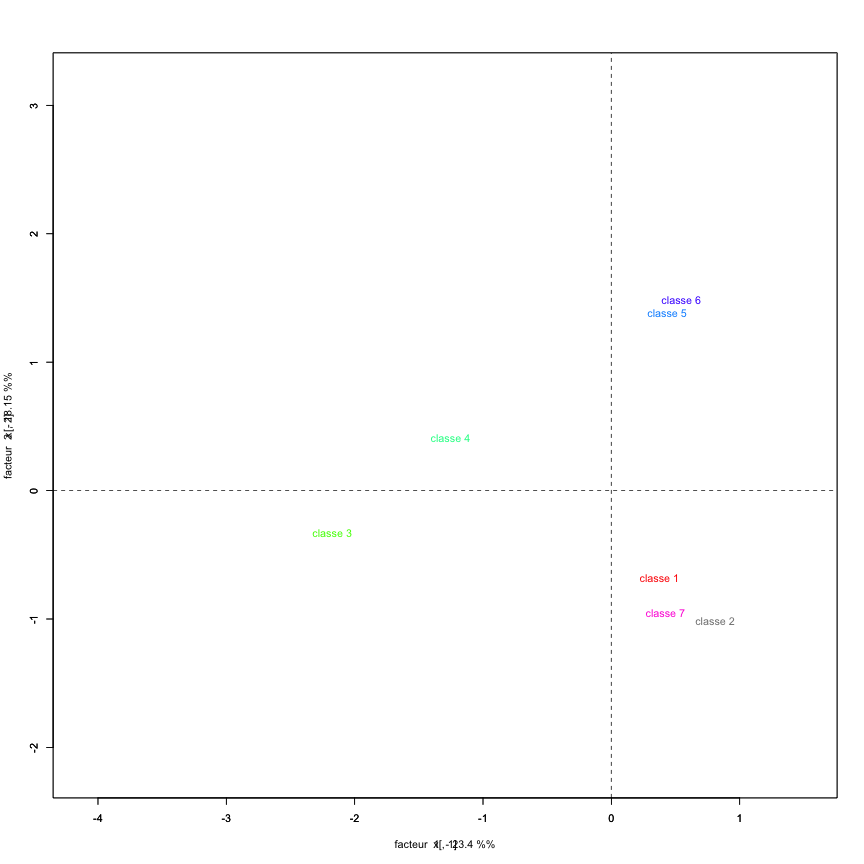
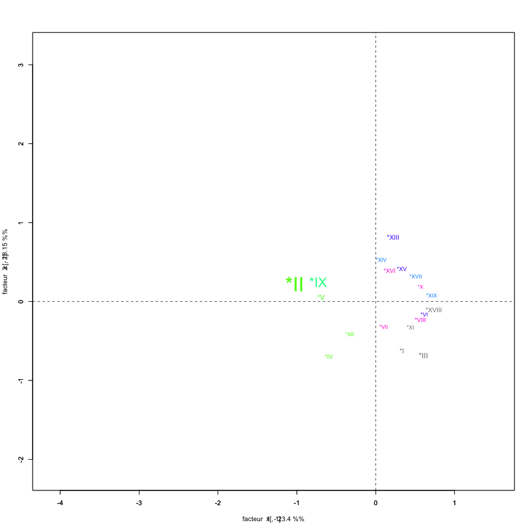
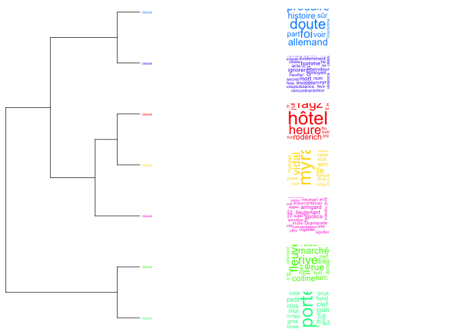
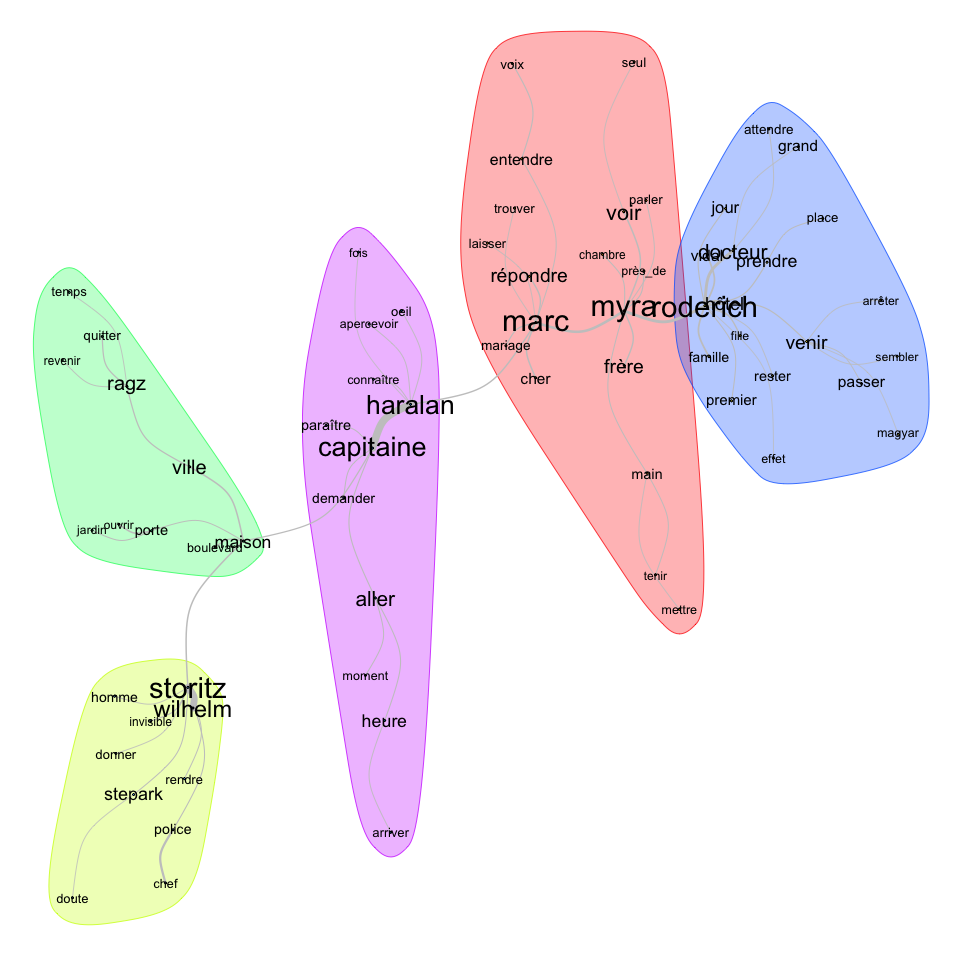
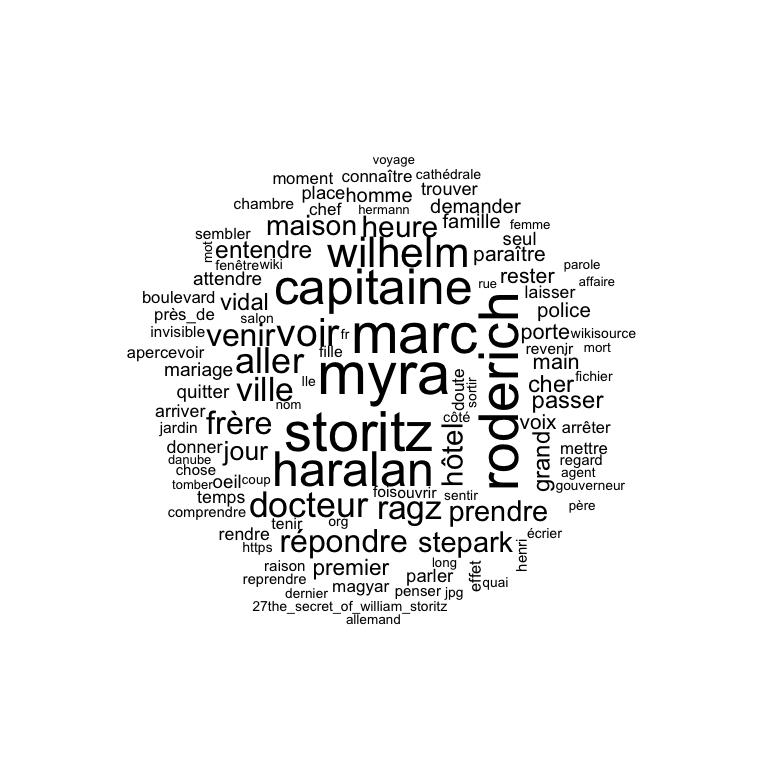
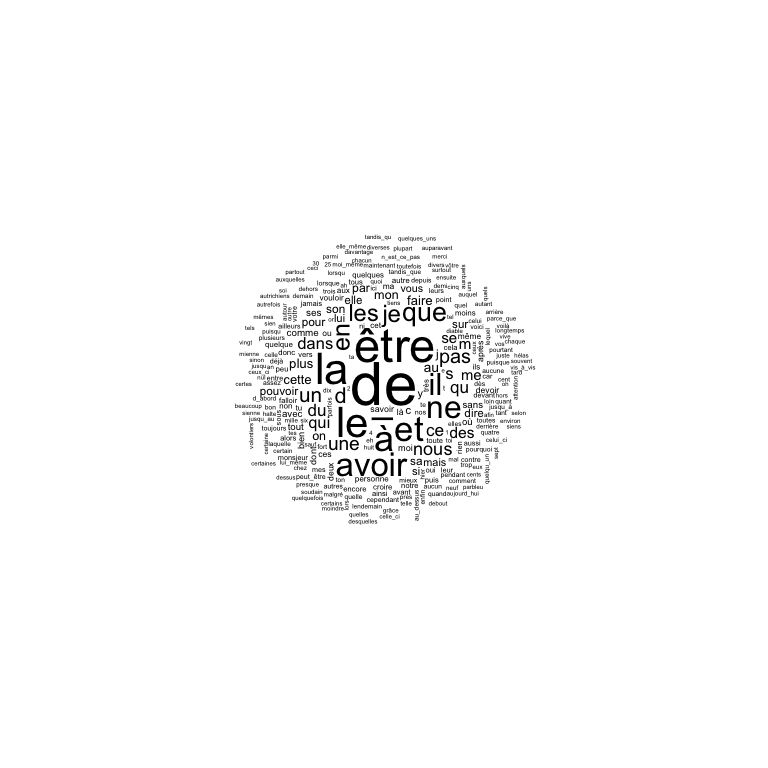
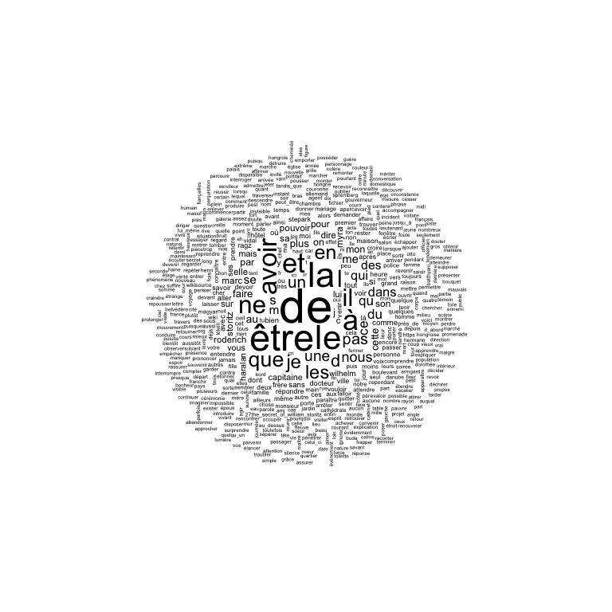

# Barry_Ahmed_Ismael_LeSecretdeWilhelmStoritz

Ce dossier est composé d'un ensemble d'infographie et de bases de données portant sur les visualisations de type nuages de mots-clés, la classification automatique et le nombre d’occurrences.

**Etape 1: Recuperation et traitement du fichier texte**

Après avoir téléchargé le fichier texte sur le site **wikisource.com**, j'ai procédé à un nettoyage afin de ne garder que le texte du récit permettant de garantir la pertinence des résultats attendus. Pour que le fichier puisse être modulable dans le logiciel et permettre une production effective de données visualisbales  j'ai procédé à un codage de texte grâce à la balise suivante:  
**** *I
**** *II
**** *III 

J'ai ensuite sauvegardé le ficchier sous nom: Le-Secret-de-Wilhem-Storitz_Jules-Vernes.txt

**Etape 2:  Analyse et production de données par IRAMUTEQ**

Ayant obtenu 19 nombres de textes après analyse du fichier par **Iramuteq**, chiffre qui correspond excatement au nombre de chapitres qui composent mon fichier texte on peu en deduire que la phase de traitement de texte a été bien réalisée.

**Fichiers CSV** 

Pour obtenir un résumé sur les chiffres de mon document, j'ai procédé par la fonction statistique, cette fonctionalité du logoiciel m'a permis aussi d'extraire les fichier CSV.

**La fonctionnalité Spécificité/AFC et graphiques**

La fonctionnalité Spécificité et AFC a permis d'obtenir les graphiques d'AFC sur les formes. Les formes actives et suplémentaires ont été utilisées, ensuite j'ai procédé à une sélection par modalités car n'ayant pas de variables effectives. Il faut noter que ces graphiques sont les résultats obtenus avec des variables actives.

**Fonctionalité Reinert et graphiques**

Pour obtenir les graphiques de la fonction Reinert, le logicel a été paramétré de façon a avoir à 19 nombres de phases terminal de phase 1. Ainsi les graphiques obtenus sont lisibles et compréhensibles.

**Analyses des similitudes**

Pour obtenir les graphiques d'analyse des similitudes, le logiciel a été paramétré de sorte à avoir 69 formes ayant une fréquence d'apparition allant du minimum 40 au maximum 230 afin d'avoir. Vu la masse de mots que comportait le texte il était nécéssaire de ne garder que les plus récurents afin de garanatir une compréhension des graphiques.

**Nuage de mots**

Nuage de mots avec des formes actives.

Le graphiques de nuage de mots comportant des formes actives à nécéssité une réduction d'effectif afin de ne garder que les mots ayant une fréquence d'apparition allant de minimum 30 au maximum 230.

Nuage de mots avec des formes supplémentaires.

Nuage de mots avec des formes actives et supplémentaires.

Il en ressort un taux élevé de formes supplémentaires ceci du a leur grand nombre dans le texte. 
Les formes 
